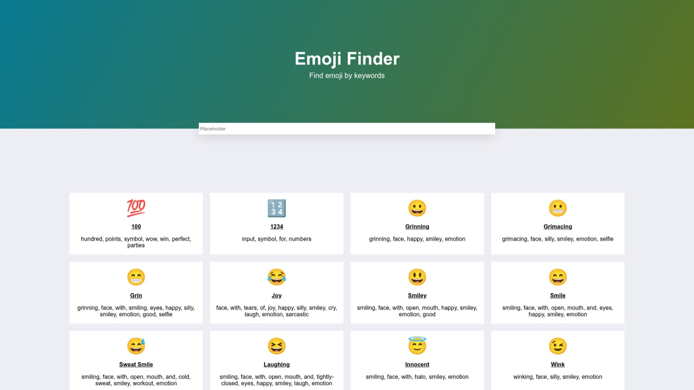

# Emoji Finder

**Search ~1,800 emojis by keyword and copy them with one click.**



**[Try it live →](https://anastacodes.github.io/emojiFinderReact/)**

## Features

- Instant keyword search over a local emoji dataset — no API round-trips
- Keyword deduplication for cleaner search matching
- Component-based UI (Form, Card, Container) styled with CSS Modules
- Deployed to GitHub Pages via `gh-pages`

## Tech stack

React 18 · Vite 5 · CSS Modules

## Run locally

```bash
git clone https://github.com/AnastaCodes/emojiFinderReact.git
cd emojiFinderReact
npm install
npm run dev
```
